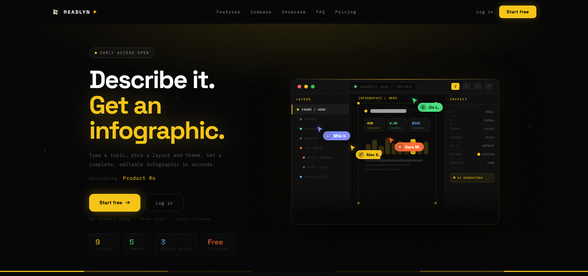

<div align="center">

  

# Readlyn

**AI-powered infographic generator describe any topic, get a stunning visual in seconds**

[](https://readlyn.vercel.app)
[](https://github.com/MuhammadTanveerAbbas/Readlyn)
[](LICENSE)
[](https://typescriptlang.org)
[](https://nextjs.org)
[](https://supabase.com)
[](https://tailwindcss.com)

</div>

---

<div align="center">
  
</div>

---

## Overview

Readlyn turns plain text prompts into professional infographics using Groq AI (Llama 3.3 70B). Instead of spending hours in Canva or Figma, you describe your topic, pick a layout style and theme, and the AI generates a fully structured, pixel-perfect infographic on a Fabric.js canvas ready to export as PNG or JSON. Built for content creators, marketers, and developers who need visual content fast.

---

## ✨ Features

- 🤖 **AI Infographic Generation** Describe any topic and Groq AI (Llama 3.3 70B) generates a complete, data-rich infographic with real facts and statistics
- 🎨 **9 Layout Archetypes** Steps, Stats, Timeline, Compare, List, Pyramid, Funnel, Cycle, or Auto each with mathematically pre-computed element positions
- 🖌️ **5 Color Themes** Violet, Ocean, Ember, Forest, and Slate palettes applied consistently across every generated element
- 📐 **3 Canvas Sizes** A4 Portrait (800×1100), Square (1080×1080), and Wide (1920×600) for any use case
- 🖱️ **Interactive Canvas Editor** Drag, resize, rotate, and edit any element directly on the Fabric.js canvas with select and hand tool modes
- 🔢 **Layers Panel** Full layer management with visibility toggle, lock/unlock, and per-layer deletion
- ⚙️ **Properties Panel** Edit transform (X, Y, W, H, rotation, opacity), fill/stroke colors, border radius, and typography per selected element
- ↩️ **Undo / Redo** Full canvas history with keyboard shortcuts (Cmd+Z / Cmd+Shift+Z)
- 📤 **Export PNG & JSON** Download as high-res PNG or save the raw JSON schema for later
- 🔒 **Auth with Supabase** Email/password sign up, login, forgot password, and protected routes via middleware
- ⚡ **Streaming Generation** Elements stream to the canvas in real time as the AI generates them
- 🔍 **Zoom Controls** Zoom in/out, fit-to-screen, mouse wheel zoom toward cursor, and pan with hand tool or Space+drag

---

## 🎨 Design System

Readlyn uses a hand-crafted dark design language think Resend meets Framer. The visual layer was fully overhauled from the v0.dev scaffold:

- **Background scale** `#080808` base with `#0f0f0f` cards and `#161616` inputs. No pure black.
- **Yellow accent (`#F5C518`)** Used sparingly: primary CTAs, active states, icon containers, and inline accent text only.
- **Typography** Mixed-case headings with tight tracking (`-0.02em` to `-0.03em`). All-caps reserved for labels and badges only.
- **Noise texture** Subtle SVG fractal noise overlay on all pages for depth.
- **Scroll animations** `useReveal()` hook triggers `animate-fade-up` at 15% viewport entry on every section.
- **Micro-interactions** `hover:scale-[1.02] active:scale-[0.98]` on buttons, border brightens + top accent line on cards, yellow focus ring on inputs, chevron rotation on FAQ accordion.
- **Auth pages** Card with deep shadow, labeled inputs, yellow glow submit button, `animate-fade-up` on mount.
- **Canvas editor** Panels at `#0f0f0f`, borders at `rgba(255,255,255,0.07)`, active tool uses `#F5C518`, generate button with glow.

---

## 🛠 Tech Stack

| Category        | Technology                                         |
| --------------- | -------------------------------------------------- |
| Framework       | Next.js 16 + React 19 + TypeScript                 |
| Styling         | Tailwind CSS v4 + shadcn/ui + Radix UI             |
| Canvas          | Fabric.js v6                                       |
| AI              | Groq (`llama-3.3-70b-versatile`) via Vercel AI SDK |
| Auth & Database | Supabase (Auth + SSR)                              |
| Fonts           | Space Grotesk + IBM Plex Mono                      |
| Deployment      | Vercel                                             |

---

## 🚀 Quick Start

### Prerequisites

- Node.js 18+
- pnpm (recommended) or npm
- Supabase account
- Groq API key (free at [console.groq.com](https://console.groq.com/keys))

### Installation

```bash
# 1. Clone the repo
git clone https://github.com/MuhammadTanveerAbbas/Readlyn.git
cd Readlyn

# 2. Install dependencies
pnpm install

# 3. Set up environment variables
cp .env.example .env.local
# Fill in your values (see Environment Variables section below)

# 4. Run the development server
pnpm dev

# 5. Open in browser
http://localhost:3000
```

---

## 🔐 Environment Variables

Create a `.env.local` file in the root directory (or copy `.env.example`):

```env
# Supabase  Project Settings → API
NEXT_PUBLIC_SUPABASE_URL=https://your-project-ref.supabase.co
NEXT_PUBLIC_SUPABASE_ANON_KEY=your-supabase-anon-key

# Groq  https://console.groq.com/keys
GROQ_API_KEY=your-groq-api-key
```

Get your keys:

- **Supabase:** [https://supabase.com](https://supabase.com) → Project Settings → API
- **Groq:** [https://console.groq.com/keys](https://console.groq.com/keys) → Create API Key (free tier available)

> `GROQ_API_KEY` is server-side only (no `NEXT_PUBLIC_` prefix). The `NEXT_PUBLIC_` Supabase vars are safe to expose to the browser.

### Supabase Setup

After creating your Supabase project, run the schema in `supabase/schema.sql` via the Supabase SQL editor to create the required tables (`projects`, `templates`, `generation_history`) and enable Row Level Security.

---

## 📁 Project Structure

```
readlyn/
├── app/
│   ├── (auth)/              # Login, signup, forgot-password pages
│   ├── (protected)/         # Dashboard + app editor (auth-gated)
│   ├── api/generate/        # Streaming AI generation endpoint
│   ├── globals.css          # Design tokens, noise texture, animations
│   └── layout.tsx
├── components/
│   ├── app/                 # Editor UI: Canvas, Toolbar, Layers, Properties, Prompt
│   ├── auth/                # AuthCard with refined dark card design
│   ├── landing/             # Landing page sections (all "use client" with useReveal)
│   └── ui/                  # shadcn/ui primitives
├── hooks/
│   ├── use-canvas-history.ts
│   ├── use-canvas-selection.ts
│   ├── use-reveal.ts        # IntersectionObserver scroll animation hook
│   └── use-mobile.ts
├── lib/
│   ├── archetypeLayouts.ts  # Pre-computed pixel positions for all layout archetypes
│   ├── contentAwareness.ts  # AI content analysis helpers
│   ├── defaultInfographic.ts
│   ├── exportMultiFormat.ts # PNG / ZIP export logic
│   ├── groq.ts              # Groq client + model constant
│   ├── renderElements.ts    # Fabric.js object factory + canvas renderer
│   └── supabase/            # Client, server, middleware helpers
├── types/
│   └── infographic.ts       # Zod schemas + TypeScript types for all element types
├── supabase/
│   └── schema.sql           # Database schema  run this in Supabase SQL editor
├── proxy.ts                 # Auth middleware (route protection)
├── .env.example
└── package.json
```

---

## 📦 Available Scripts

| Command      | Description              |
| ------------ | ------------------------ |
| `pnpm dev`   | Start development server |
| `pnpm build` | Build for production     |
| `pnpm start` | Start production server  |
| `pnpm lint`  | Run ESLint               |

---

## 🌐 Deployment

This project is deployed on **Vercel**.

### Deploy Your Own

[](https://vercel.com/new/clone?repository-url=https://github.com/MuhammadTanveerAbbas/Readlyn)

1. Click the button above
2. Connect your GitHub account
3. Add the following environment variables in the Vercel dashboard:
   - `NEXT_PUBLIC_SUPABASE_URL`
   - `NEXT_PUBLIC_SUPABASE_ANON_KEY`
   - `GROQ_API_KEY`
4. Deploy

> The `/api/generate` route uses streaming and has a 60-second max duration this works on Vercel's Hobby plan.

---

## 🗺 Roadmap

- [x] AI infographic generation with Groq (Llama 3.3 70B)
- [x] 9 layout archetypes with pre-computed positions
- [x] Interactive Fabric.js canvas editor
- [x] Layers panel with visibility and lock controls
- [x] Properties panel for transform, color, and typography
- [x] PNG and JSON export
- [x] Supabase authentication
- [x] Streaming partial generation
- [x] Generation history per project
- [x] Multi-format export (PNG, ZIP)
- [ ] Real-time team collaboration
- [ ] Custom font upload
- [ ] Figma import
- [ ] More canvas sizes (Instagram Story, Twitter/X banner)
- [ ] Image element support

---

## 🤝 Contributing

Contributions are welcome!

1. Fork the repository
2. Create a feature branch (`git checkout -b feature/amazing-feature`)
3. Commit your changes (`git commit -m 'Add amazing feature'`)
4. Push to the branch (`git push origin feature/amazing-feature`)
5. Open a Pull Request

---

## 📄 License

Distributed under the MIT License. See `LICENSE` for more information.

---

## 👨‍💻 Built by The MVP Guy

<div align="center">

**Muhammad Tanveer Abbas**
SaaS Developer | Building production-ready MVPs in 14–21 days

[](https://themvpguy.vercel.app)
[](https://github.com/MuhammadTanveerAbbas)
[](https://x.com/themvpguy)
[](https://linkedin.com/in/muhammadtanveerabbas)

**Repository:** [https://github.com/MuhammadTanveerAbbas/Readlyn](https://github.com/MuhammadTanveerAbbas/Readlyn)

_If this project helped you, please consider giving it a ⭐_

</div>
