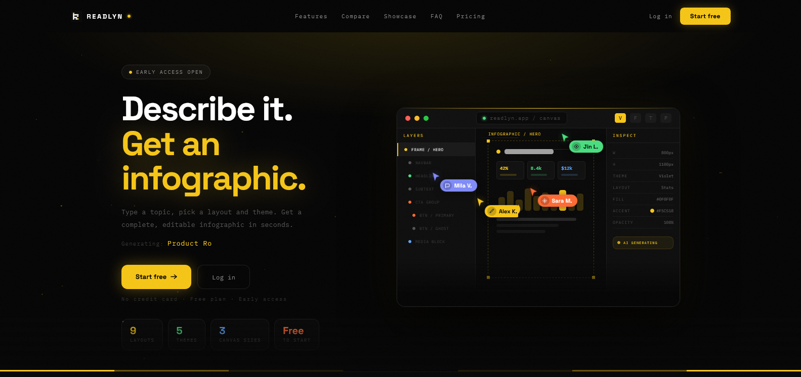

<div align="center">

  

# Readlyn

**AI-powered infographic generator, describe any topic, get a stunning visual in seconds**

[](https://readlyn.vercel.app)
[](https://github.com/MuhammadTanveerAbbas/Readlyn)
[](LICENSE)
[](https://typescriptlang.org)
[](https://nextjs.org)
[](https://supabase.com)
[](https://sdk.vercel.ai)
[](https://upstash.com)
[](https://tailwindcss.com)
[](https://vitest.dev)

</div>

---

<div align="center">
  
</div>

---

## Overview

Readlyn turns plain text prompts into professional infographics using Groq with runtime model discovery plus automatic model fallback. The configured default is `openai/gpt-oss-120b` (override with `GROQ_MODEL`). You describe your topic, pick a layout style plus theme, then the AI streams a fully structured infographic onto a Fabric.js canvas, ready to export as PNG or JSON. Built for content creators, marketers, plus developers who need visual content fast.

---

## 🧾 Product Status (Early Access)

Readlyn is in early access. This README describes what the code actually does today.

- Every feature is unlocked for everyone during early access.
- Fair use cap: 100 generations per day per user (`FAIR_USE_DAILY_GENERATIONS` in `config/plans.ts`).
- Free plan: unlimited active projects, 100 generations per day (fair use).
- Paid tiers (Pro, Team) are placeholders. Their extra features are labelled "(coming soon)".
- There is no billing or Stripe integration yet, so choosing a paid tier changes nothing.

### Not built yet

These do not exist in the product today:

- SVG export
- Real time collaboration
- Team features
- Billing or Stripe integration
- Figma import
- Custom font upload
- Image elements in the infographic editor
- Named checkpoints

---

## ✨ Features

- 🤖 **AI Infographic Generation** Describe any topic, plus Groq generates a complete, data-rich infographic with facts plus statistics. Models are discovered at runtime with automatic fallback.
- 🎨 **9 Layout Archetypes** Steps, Stats, Timeline, Compare, List, Pyramid, Funnel, Cycle, or Auto, each with mathematically pre-computed element positions
- 🖌️ **5 Color Themes** Ocean, Ember, Forest, Slate, plus Midnight palettes applied consistently across every generated element
- 📐 **3 Canvas Sizes** A4 Portrait (800x1100), Square (1080x1080), plus Wide (1920x600)
- ⚡ **Streaming Generation** Elements stream to the canvas in real time while the AI generates them
- 🖱️ **Interactive Canvas Editor** Drag, resize, rotate, plus edit any element on the Fabric.js canvas with select plus hand tool modes
- 🔢 **Layers Panel** Visibility toggle, lock/unlock, reorder via drag, plus per-layer delete
- ⚙️ **Properties Panel** Transform (X, Y, W, H, rotation, opacity), appearance (fill, stroke, border radius), typography, front, back, duplicate, delete, plus Auto Theme
- ↩️ **Undo / Redo** Full canvas history that captures every edit (Ctrl+Z / Cmd+Z, Ctrl+Shift+Z)
- ⌨️ **Keyboard Shortcuts** V (select), H (hand), Space+drag pan, wheel zoom, Delete/Backspace, Ctrl+D duplicate, arrow nudge, `?` opens the shortcuts panel
- 🔍 **Zoom Controls** Zoom in/out, fit-to-screen, mouse wheel zoom toward cursor, plus pan with the hand tool
- 📤 **PNG plus JSON Export** Download a high-res PNG, or save the raw JSON schema for later
- 📦 **Multi-Format ZIP Export** Scales content into A4, Square, Wide, Story, plus LinkedIn frames
- 🗂 **Generation History** Per project snapshots with thumbnails, restore, plus delete
- 🎯 **Content Check** Readability plus overflow analysis with honest labels
- 🎛 **Design Tokens Modal** W3C format JSON design tokens
- 🧰 **Dev Mode Inspect** CSS, React, plus SVG snippets for the current canvas
- 🏷️ **Brand Kit** Saved to localStorage, plus applied to the canvas
- 📴 **Offline Buffer plus Autosave** Queues edits while the browser is offline, plus debounced autosave in the editor
- 🔒 **Auth with Supabase** Email/password sign up, login, forgot password, plus protected routes via Next.js proxy
- ⚙️ **Settings Page** Account management, including account deletion
- 🖼️ **Parallax Studio** Standalone layer-based parallax scene builder with 6 presets, config panel, desktop/tablet/mobile viewport modes, image upload, plus clean HTML/CSS/JS code export
- 🛡 **Security** CSRF protection, rate limiting, input sanitization, plus UUID route validation
- 🩺 **Ops** Health endpoint (`/api/health`), sitemap, plus robots

---

## 🎨 Design System

Readlyn uses a hand-crafted dark design language (think Resend meets Framer). The entire UI is driven by CSS custom properties defined in `globals.css`:

- **Background scale** `--bg-base` (#080808), `--bg-panel` (#0f0f0f), `--bg-elevated` (#161616). No pure black.
- **Accent (`--accent`: #F5C518)** Used sparingly: primary CTAs, active states, icon containers, plus inline accent text only.
- **Semantic tokens** `--text-primary`, `--text-secondary`, `--text-body`, `--text-muted-val`, `--text-dim` for typography, plus `--destructive`, `--success`, `--purple`, `--blue`, `--orange` for status plus accent colors.
- **Typography** Mixed-case headings with tight tracking (`-0.02em` to `-0.03em`). All-caps reserved for labels plus badges only.
- **Noise texture** Subtle SVG fractal noise overlay on all pages for depth.
- **Scroll animations** `useReveal()` hook triggers `animate-fade-up` at 15% viewport entry on every section.
- **Micro-interactions** `hover:scale-[1.02] active:scale-[0.98]` on buttons, border brightens plus top accent line on cards, yellow focus ring on inputs, chevron rotation on FAQ accordion.
- **Auth pages** Card with deep shadow, labeled inputs, yellow glow submit button, `animate-fade-up` on mount.
- **Canvas editor** Panels at `--bg-panel`, borders at `--border-default`, active tool uses `--accent`, generate button with glow.

---

## 🛠 Tech Stack

| Category           | Technology                                                                    |
| ------------------ | ----------------------------------------------------------------------------- |
| Framework          | Next.js 16 + React 19 + TypeScript                                            |
| Styling            | Tailwind CSS v4 + Radix UI                                                    |
| Canvas             | Fabric.js v6                                                                  |
| Parallax           | Pure CSS transforms (no extra dependencies)                                   |
| AI                 | Groq via Vercel AI SDK (runtime model discovery plus auto fallback, default `openai/gpt-oss-120b`) |
| Rate Limiting      | Upstash Redis (with in-memory fallback for development)                       |
| Auth & Database    | Supabase (Auth plus Postgres)                                                 |
| Input Sanitization | isomorphic-dompurify                                                          |
| Testing            | Vitest (unit) plus Playwright (e2e)                                           |
| Fonts              | Space Grotesk + IBM Plex Mono                                                 |
| Deployment         | Vercel                                                                        |

---

## 🚀 Quick Start

### Prerequisites

- Node.js 18+
- pnpm (recommended) or npm
- Supabase account
- Groq API key (free at [console.groq.com](https://console.groq.com/keys))

### Installation

```bash
# 1. Clone the repo
git clone https://github.com/MuhammadTanveerAbbas/Readlyn.git
cd Readlyn

# 2. Install dependencies
pnpm install

# 3. Set up environment variables
cp .env.example .env.local
# Fill in your values (see the Environment Variables section below)

# 4. Run the development server
pnpm dev

# 5. Open in browser
http://localhost:3000
```

---

## 🔐 Environment Variables

Create a `.env.local` file in the root directory (or copy `.env.example`):

```env
# Required
NEXT_PUBLIC_SUPABASE_URL=https://your-project-ref.supabase.co
NEXT_PUBLIC_SUPABASE_ANON_KEY=your-supabase-anon-key
GROQ_API_KEY=your-groq-api-key

# Optional, AI model override (default openai/gpt-oss-120b)
# GROQ_MODEL=openai/gpt-oss-120b

# Optional (rate limiting)  https://console.upstash.com/redis
# Without these, rate limiting falls back to an in-memory store.
UPSTASH_REDIS_REST_URL=https://your-upstash-url.upstash.io
UPSTASH_REDIS_REST_TOKEN=your-upstash-token
```

Get your keys:

- **Supabase:** [https://supabase.com](https://supabase.com) ➔ Project Settings ➔ API
- **Groq:** [https://console.groq.com/keys](https://console.groq.com/keys) ➔ Create API Key (free tier available)
- **Upstash Redis:** [https://console.upstash.com/redis](https://console.upstash.com/redis) ➔ Create a database ➔ Copy REST URL plus Token

> `GROQ_API_KEY` is server-side only (no `NEXT_PUBLIC_` prefix). The `NEXT_PUBLIC_` Supabase vars are safe to expose to the browser.

### Testing

```bash
pnpm test        # Run unit tests (Vitest)
pnpm test:watch  # Watch mode (Vitest)
pnpm test:e2e    # End to end tests (Playwright)
```

Unit tests use **Vitest** with path alias resolution (`@/` ➔ `./`). Test files live in `tests/` (infographic, security, plans, export-transform, archetype-layouts). `pnpm test:e2e` runs Playwright. No Playwright config file or e2e specs are committed yet, so you may need to add them locally.

---

## 🛡 Security

- **CSRF Protection** All state-changing API routes (`/api/generate`, `/api/account/delete`, `/api/export-multi`, `/api/keep-alive`) validate that the `Origin` header matches the deployed host.
- **Rate Limiting** The `/api/generate` route enforces the fair use cap of 100 generations per day per user (`FAIR_USE_DAILY_GENERATIONS` in `config/plans.ts`). Uses Upstash Redis in production, falls back to an in-memory `Map` when Upstash env vars are absent.
- **Input Sanitization** Prompt text is stripped of HTML tags plus control characters before it is sent to the AI. Generated output is sanitized via `isomorphic-dompurify` to prevent XSS.
- **Route Params** All dynamic route segments (`[id]`) are validated as UUIDs via `parseRouteId()`.

---

## 📋 Plans plus Fair Use

Plan definitions live in `config/plans.ts`.

- **Free ($0, forever)** Unlimited active projects, 100 AI generations per day (fair use), all 9 archetypes plus 5 themes, canvas editing, history, export, design tokens, brand kit, plus dev mode inspect.
- **Pro ($15 per month)** plus **Team ($35 per user per month)** Early access placeholder tiers. Their extra features are labelled "(coming soon)". No billing is wired up, so upgrading does nothing today.
- **Fair use** `FAIR_USE_DAILY_GENERATIONS = 100` caps generations per day per user for every account. It is a safety net, not a plan gate.

To adjust limits, edit `PLANS` plus `FAIR_USE_DAILY_GENERATIONS` in `config/plans.ts`.

---

### Supabase Setup

After creating your Supabase project, run the schema in `supabase/schema.sql` via the Supabase SQL editor to create the required tables (`projects`, `templates`, `generation_history`) plus enable Row Level Security.

---

## 📁 Project Structure

```
readlyn/
|-- app/
|   |-- (auth)/              # Login, signup, forgot-password pages
|   |-- (protected)/         # Dashboard, app editor, settings, tools (auth-gated)
|   |-- api/generate/        # AI generation (Vercel AI SDK, CSRF, rate limit, sanitize)
|   |-- api/export-multi/    # Multi-format ZIP export
|   |-- api/account/delete/  # Account deletion endpoint
|   |-- api/keep-alive/      # Keep-alive ping
|   |-- api/health/          # Health endpoint
|   |-- globals.css          # Design tokens (CSS custom properties), noise texture, animations
|   |-- robots.txt           # Robots rules
|   |-- sitemap.xml          # Sitemap
|   |-- layout.tsx
|-- components/
|   |-- app/                 # Editor UI (Canvas, Toolbar, Layers, Properties, Prompt, modals)
|   |-- auth/                # AuthCard with refined dark card design
|   |-- landing/             # Landing page sections (all "use client" with useReveal)
|   |-- parallax/            # Parallax Studio (Preview, ConfigPanel, ImagePicker, ExportModal)
|   |-- ui/                  # Shared UI primitives
|-- config/
|   |-- plans.ts             # Plan definitions plus fair use cap
|-- hooks/
|   |-- use-canvas-history.ts    # Undo plus redo history
|   |-- use-canvas-selection.ts  # Selection sync
|   |-- use-offline-buffer.ts    # Offline edit queue
|   |-- use-reveal.ts            # IntersectionObserver scroll animation hook
|   |-- use-toast.ts             # Toast notifications
|-- lib/
|   |-- archetypeLayouts.ts   # Pre-computed pixel positions for all layout archetypes
|   |-- aspectRatioReflow.ts  # Aspect ratio reflow helpers (currently unused)
|   |-- autoTheme.ts          # Auto Theme color logic
|   |-- code-generator.ts     # HTML/CSS/JS export for parallax scenes
|   |-- contentAwareness.ts   # Content check (readability plus overflow) helpers
|   |-- csrf.ts               # Origin plus Host CSRF validation for API routes
|   |-- defaultInfographic.ts # Default infographic document
|   |-- design-tokens.json    # W3C design tokens
|   |-- env.ts                # Environment variable validation
|   |-- exportMultiFormat.ts  # PNG plus ZIP export logic
|   |-- groq.ts               # Groq model discovery, fallback, plus self healing
|   |-- parallax-types.ts     # Parallax Studio types, defaults, constants
|   |-- parallax-upload.ts    # Supabase Storage upload for parallax images
|   |-- params.ts             # UUID route param validator
|   |-- presets.ts            # 6 parallax scene presets
|   |-- rate-limit.ts         # Upstash Redis rate limiter (with in-memory fallback)
|   |-- renderElements.ts     # Fabric.js object factory plus canvas renderer
|   |-- sanitize.ts           # Prompt plus output sanitization (isomorphic-dompurify)
|   |-- themeColors.ts        # Theme palette colors
|   |-- utils.ts              # Small helpers
|   |-- supabase/             # Client, server, middleware helpers
|-- tests/
|   |-- infographic.test.ts
|   |-- security.test.ts
|   |-- plans.test.ts
|   |-- export-transform.test.ts
|   |-- archetype-layouts.test.ts
|-- types/
|   |-- infographic.ts        # Zod schemas plus TypeScript types for all element types
|-- supabase/
|   |-- schema.sql            # Database schema (run this in Supabase SQL editor)
|-- proxy.ts                  # Auth middleware (route protection)
|-- vitest.config.ts          # Vitest configuration
|-- .env.example
|-- package.json
```

---

## 📦 Available Scripts

| Command          | Description                       |
| ---------------- | --------------------------------- |
| `pnpm dev`       | Start development server          |
| `pnpm build`     | Build for production              |
| `pnpm start`     | Start production server           |
| `pnpm lint`      | Run ESLint                        |
| `pnpm typecheck` | Run TypeScript type checking      |
| `pnpm test`      | Run Vitest unit tests             |
| `pnpm test:watch`| Run Vitest in watch mode          |
| `pnpm test:e2e`  | Run Playwright end to end tests   |

---

## 🌐 Deployment

This project is deployed on **Vercel**.

### Deploy Your Own

[](https://vercel.com/new/clone?repository-url=https://github.com/MuhammadTanveerAbbas/Readlyn)

1. Click the button above
2. Connect your GitHub account
3. Add the following environment variables in the Vercel dashboard:
   - `NEXT_PUBLIC_SUPABASE_URL`
   - `NEXT_PUBLIC_SUPABASE_ANON_KEY`
   - `GROQ_API_KEY`
   - `GROQ_MODEL` (optional, model override)
   - `UPSTASH_REDIS_REST_URL` (optional, rate limiting)
   - `UPSTASH_REDIS_REST_TOKEN` (optional, rate limiting)
4. Deploy

> The `/api/generate` route uses streaming, with a 60-second max duration, so it works on Vercel's Hobby plan.

---

## 🗺 Roadmap

### Shipped

- [x] AI infographic generation with Groq (runtime model discovery plus auto fallback)
- [x] 9 layout archetypes with pre-computed positions
- [x] 5 color themes (ocean, ember, forest, slate, midnight)
- [x] 3 canvas sizes (A4, square, wide)
- [x] Interactive Fabric.js canvas editor (drag, resize, rotate)
- [x] Layers panel with visibility, lock, reorder, plus delete
- [x] Properties panel (transform, appearance, typography) plus Auto Theme
- [x] Undo plus redo capturing all edits
- [x] Keyboard shortcuts (undo, redo, V, H, space pan, wheel zoom, delete, Ctrl+D, arrow nudge, `?`)
- [x] PNG plus JSON export
- [x] Multi-format ZIP export (A4, square, wide, story, LinkedIn)
- [x] Design tokens modal plus dev mode inspect
- [x] Brand kit stored in localStorage
- [x] Generation history per project (restore, delete, thumbnails)
- [x] Content check (readability plus overflow)
- [x] Offline buffer plus autosave
- [x] Supabase authentication
- [x] Streaming partial generation
- [x] Settings page with account deletion
- [x] Parallax Studio (presets, config panel, viewport modes, code export, image upload)
- [x] CSRF protection on all API routes
- [x] Rate limiting via Upstash Redis (with dev fallback)
- [x] Input sanitization (strip HTML, control chars, DOMPurify)
- [x] UUID validation on all dynamic route params
- [x] Fair use cap (100 generations per day per user)
- [x] Health endpoint, sitemap, plus robots

### Not shipped yet

- [ ] SVG export
- [ ] Real time collaboration
- [ ] Team features
- [ ] Billing (Stripe) integration
- [ ] Figma import
- [ ] Custom font upload
- [ ] Image elements in the infographic editor
- [ ] Named checkpoints
- [ ] React component plus HTML/CSS code export (coming soon)
- [ ] More canvas sizes (Instagram Story, Twitter/X banner beyond the ZIP export frames)

---

## 🤝 Contributing

Contributions are welcome!

1. Fork the repository
2. Create a feature branch (`git checkout -b feature/amazing-feature`)
3. Commit your changes (`git commit -m 'Add amazing feature'`)
4. Push to the branch (`git push origin feature/amazing-feature`)
5. Open a Pull Request

---

## 📄 License

Distributed under the MIT License. See `LICENSE` for more information.

---

## 👨‍💻 Built by Muhammad Tanveer Abbas

<div align="center">

**Muhammad Tanveer Abbas**
SaaS Developer | Building production-ready MVPs in 14 to 21 days

[](https://github.com/MuhammadTanveerAbbas)
[](https://linkedin.com/in/muhammadtanveerabbas)

**Repository:** [https://github.com/MuhammadTanveerAbbas/Readlyn](https://github.com/MuhammadTanveerAbbas/Readlyn)

_If this project helped you, please consider giving it a ⭐_

</div>
